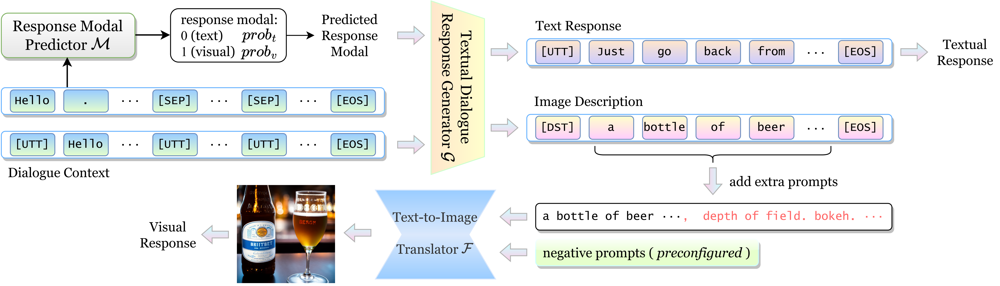
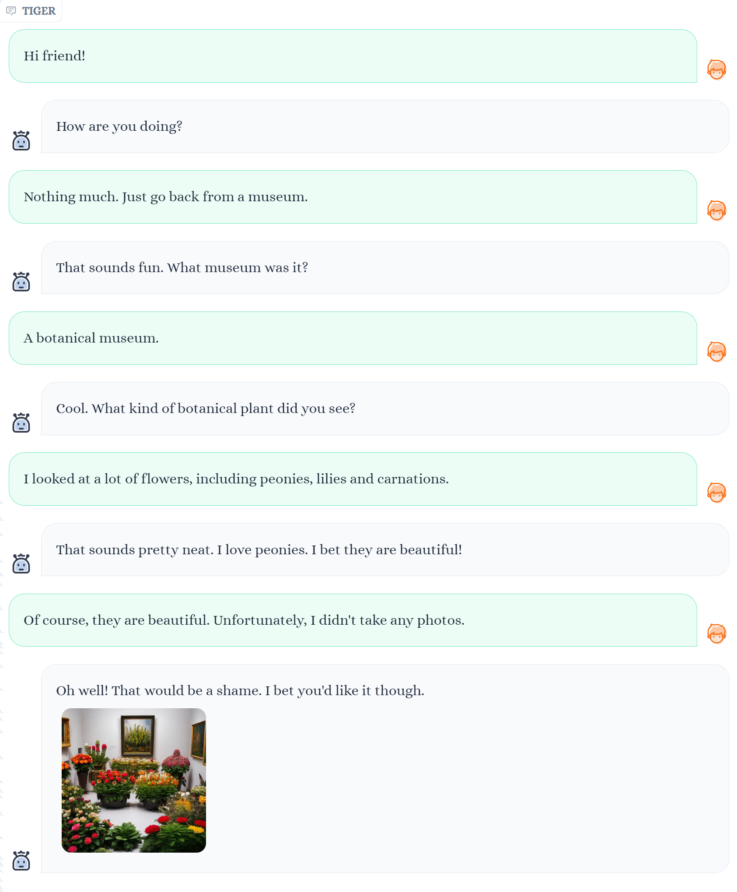
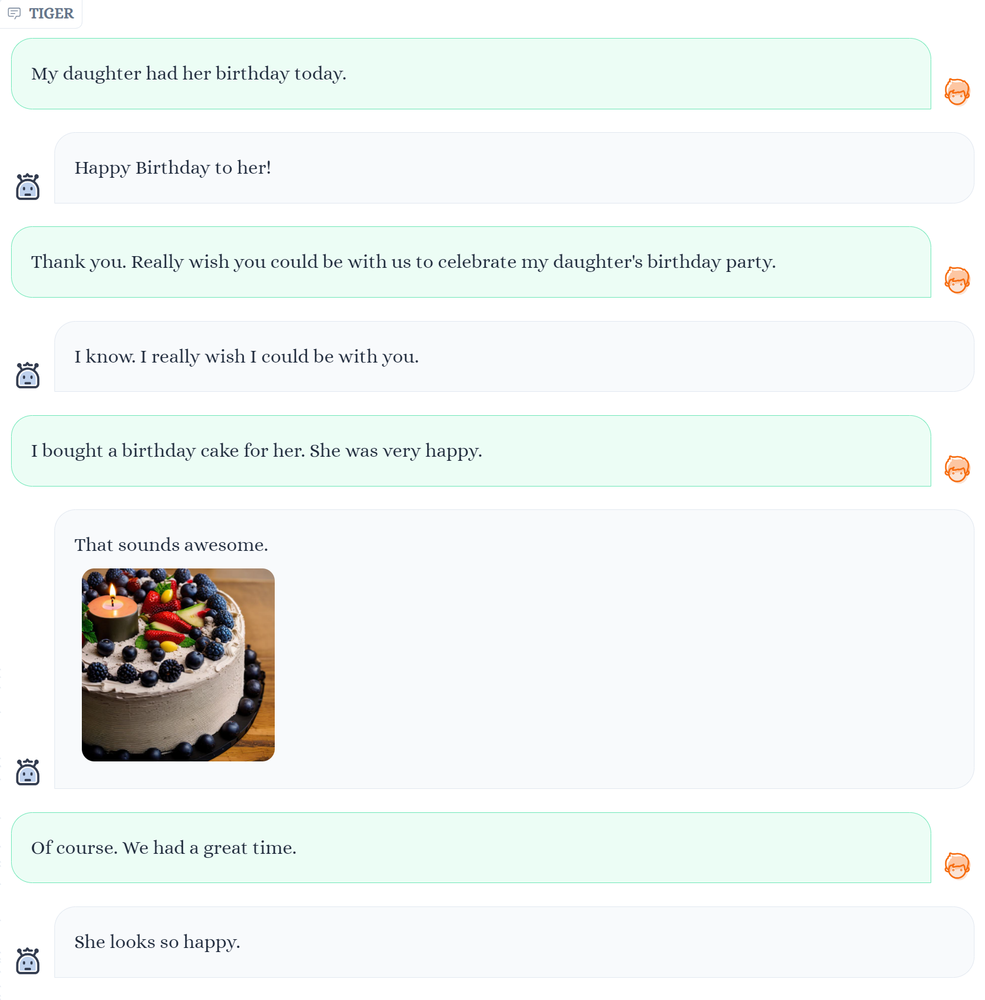
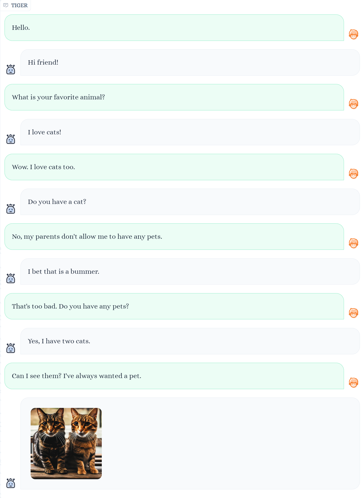
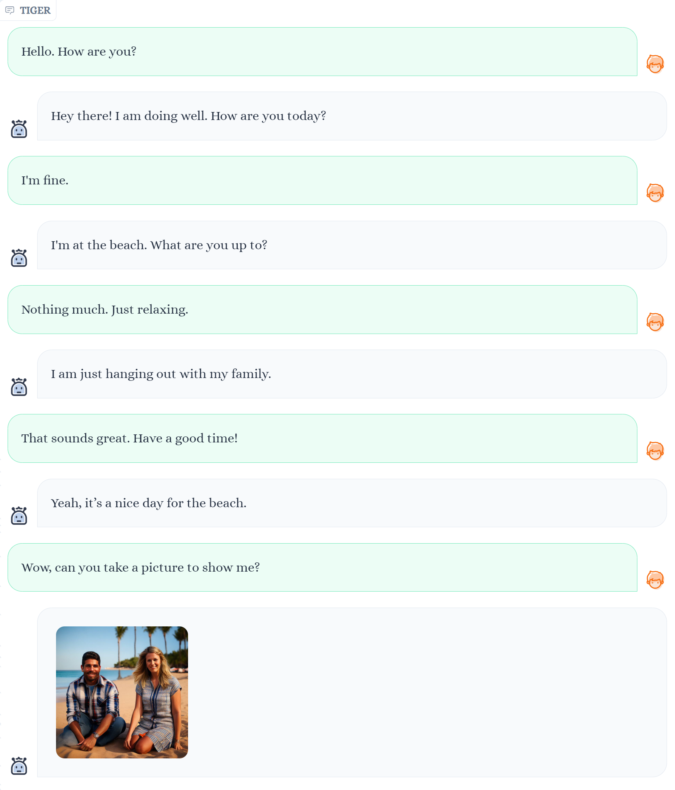

#  TIGER: A Unified Generative Model Framework for Multimodal Dialogue Response Generation

[]() [](https://youtu.be/Kd0CMwDs8Rk)

## :loudspeaker: Latest Updates

- **2024 Feb-23** : This work has been accepted by COLING 2024. Our paper will be published soon.
- **2023 Oct-13** : Updated the demo interface.


# TIGER Framework :bulb:



Figure 1: The overview of TIGER. Given the dialogue context, response modal predictor $\mathcal{M}$ determines the timing to respond with images. If the predicted response modal is text, textual dialogue response generator $\mathcal{G}$ generates the text response. Conversely, $\mathcal{G}$ produces an image description, and Text-to-Image translator $\mathcal{F}$ leverages this description to generate an image as the visual response.

# Contributions :globe_with_meridians:

- We propose **TIGER**, a unified generative model framework designed for multimodal dialogue response generation. Notably, this framework is capable of handling conversations involving any combination of modalities.
- We implement a system for multimodal dialogue response generation, incorporating both text and images, based on TIGER.
- Extensive experiments show that TIGER achieves new SOTA results on both automatic and human evaluations, which validate the effectiveness of our system in providing a superior multimodal conversational experience.

# Demo :computer:


&#9757; We implemented a multimodal dialogue system based on ```TIGER```, as depicted in figure above.    

Our system offers various modifiable components:  
- For the textual dialogue response generator, users can can choose decoding strategies and adjust related parameters.  
- For the Text-to-Image translator, users can freely modify prompt templates and negative prompt to suit different requirements. Default prompt templates and negative prompts are provided, enhancing the realism of generated images.

&#10071;**Note:** It's worth mentioning that our research focuses on open-domain multimodal dialogue response generation. However, the system may not possess perfect instruction-following capabilities. Users can treat it as a companion or listener, but using it as a QA system or AI painting generator is not recommended.

## Examples :placard:

|   |   |
:-------------------------:|:-------------------------:
 | 
 | 

# Supplementary Instructions :mag:

Restricted by the limited number of pages, we only give a clear and easy-to-understand introduction of our method in the paper. More implementation details, experimental results and discussions can be found in [supplement](supplement.md).

# Getting Start :hourglass_flowing_sand:

## Hardware :gear:

&#11088; A GPU with 24GB memory (18GB at runtime) is enough for the demo.  

## Installation :wrench:

### 1. Prepare the code and the environment
```
cd TIGER/
conda env create -f environment.yml
conda activate tiger
```

### 2. Prepare the model weights

&#10024; Please download our model weights from [here](https://drive.google.com/drive/folders/1ulc4X0yzJHQNFZJ2nyH5H9ZatZPkzZTC?usp=sharing) (Google Drive). For Text-to-Image Translator's weights, we have already uploaded it to Hugging Face, so you don't need to download it locally now. More details can be sourced from [friedrichor/stable-diffusion-2-1-realistic](https://huggingface.co/friedrichor/stable-diffusion-2-1-realistic).

The final weights would be in a single folder in a structure similar to the following:

```
TIGER
├── demo
│   └── ...
├── model_weights
│   ├── tiger_response_modal_predictor.pth
│   ├── tiger_textual_dialogue_response_generator.pth
│   └── tiger_text2image_translator
│       ├── feature_extractor
│       │   └── preprocessor_config.json
│       ├── scheduler
│       │   └── scheduler_config.json
│       ├── text_encoder
│       │   ├── config.json
│       │   └── pytorch_model.bin
│       ├── tokenizer
│       ├── merges.txt
│       ├── special_tokens_map.json
│       ├── tokenizer_config.json
│       │   └── vocab.json
│       ├── unet
│       │   ├── config.json
│       │   └── diffusion_pytorch_model.bin
│       ├── vae
│       │   ├── config.json
│       │   └── diffusion_pytorch_model.bin
│       └── model_index.json
├── tiger
│   └── ...
├── utils
│   └── ...
├── demo.py
...
```

## Launching Demo Locally :trophy:

```
python demo.py --config demo/demo_config.yaml
```

