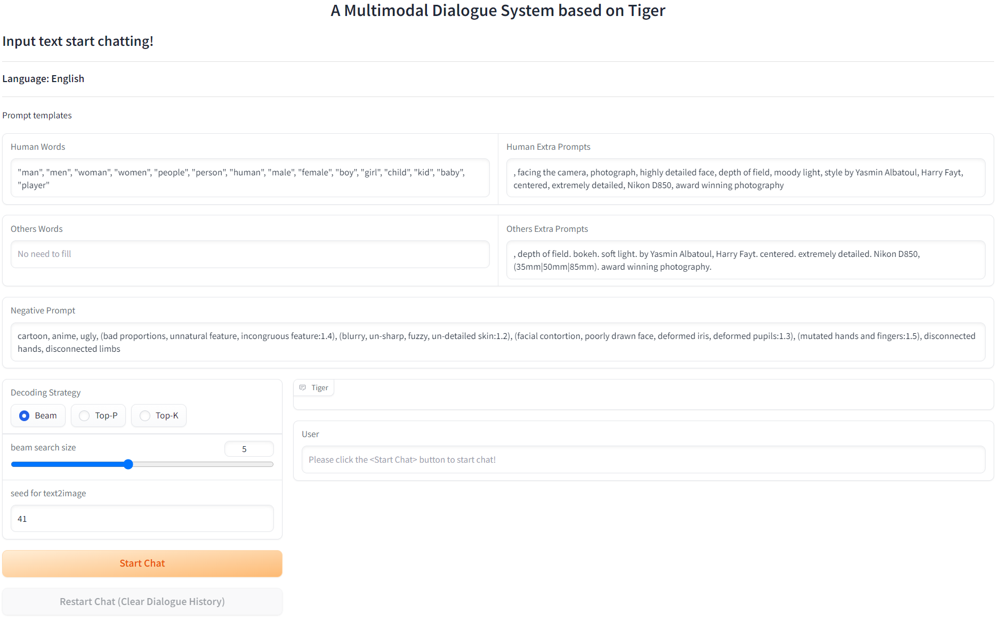
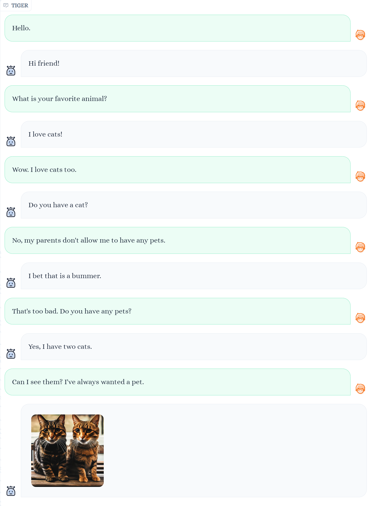
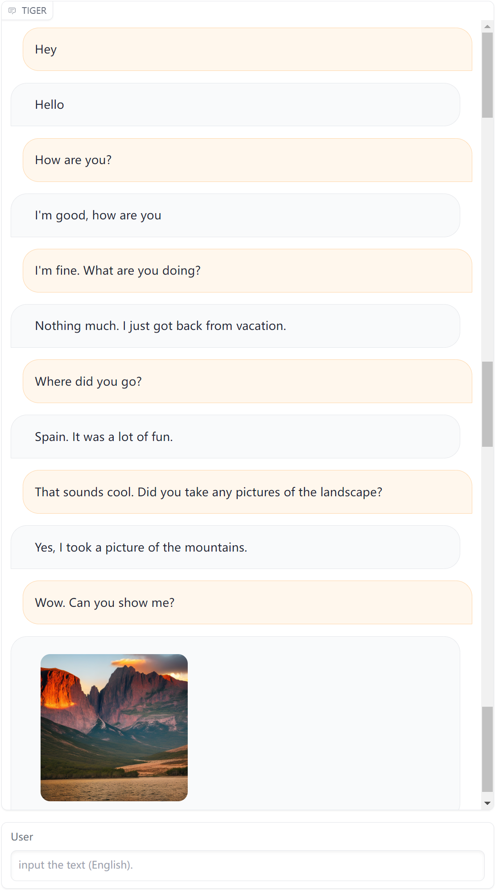

# TIGER: A Unified Generative Model Framework for Multimodal Dialogue Response Generation

[]()


# Demo



**&#8251; Note:** It's worth mentioning that our research focuses on open-domain multimodal dialogue response generation. However, the system may not possess perfect instruction-following capabilities. Users can treat it as a companion or listener, but using it as a QA system or AI painting generator is not recommended.

## Examples

|   |   |
:-------------------------:|:-------------------------:
 |  

# Getting Start

## Installation

### 1. Prepare the code and the environment
```
git clone https://github.com/friedrichor/TIGER.git
cd TIGER/
conda env create -f environment.yml
conda activate tiger
```

### 2. Prepare the model weights

Please download our model weights from [here](https://drive.google.com/drive/folders/1ulc4X0yzJHQNFZJ2nyH5H9ZatZPkzZTC?usp=sharing). The final weights would be in a single folder in a structure similar to the following:

```
TIGER
├── model_weights
│   ├── tiger_t5_base_encoder.pth
│   └── tiger_dialogpt_medium.pth
├── app.py
├── chatbot.py
...
```

For Text-to-Image Translator's weights, we have already uploaded it to Hugging Face, so you don't need to download it locally. More details can be sourced from [friedrichor/stable-diffusion-2-1-realistic](https://huggingface.co/friedrichor/stable-diffusion-2-1-realistic).

## Launching Demo Locally

```
python app.py --gpu_id 0
```


