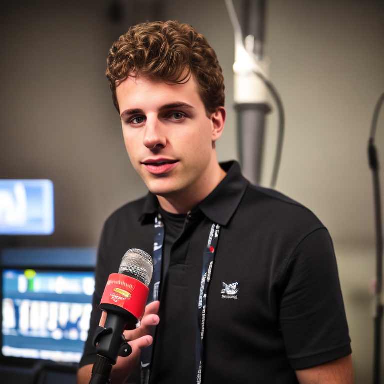

# &#128047; TIGER: A Unified Generative Model Framework for Multimodal Dialogue Response Generation

- [🐯 TIGER: A Unified Generative Model Framework for Multimodal Dialogue Response Generation](#-tiger-a-unified-generative-model-framework-for-multimodal-dialogue-response-generation)
- [Model](#model)
- [Demo](#demo)
  - [Examples](#examples)
- [Supplementary Instructions](#supplementary-instructions)
  - [Image Descriptions](#image-descriptions)
  - [Prompts](#prompts)
  - [Image Generation Results](#image-generation-results)
  - [Case Study](#case-study)
- [Discussion](#discussion)
  - [Dose the MLLMs like GPT-4 can solves this problem?](#dose-the-mllms-like-gpt-4-can-solves-this-problem)
  - [Limitations](#limitations)
- [Getting Start](#getting-start)
  - [Hardware](#hardware)
  - [Installation](#installation)
    - [1. Prepare the code and the environment](#1-prepare-the-code-and-the-environment)
    - [2. Prepare the model weights](#2-prepare-the-model-weights)
  - [Launching Demo Locally](#launching-demo-locally)


# Model


# Demo


&#9757; We implemented a multimodal dialogue system based on ```TIGER```, as depicted in figure above.    

Our system offers various modifiable components:  
- For the textual dialogue response generator, users can can choose decoding strategies and adjust related parameters.  
- For the Text-to-Image translator, users can freely modify prompt templates and negative prompt to suit different requirements. Default prompt templates and negative prompts are provided, enhancing the realism of generated images.

&#10071;**Note:** It's worth mentioning that our research focuses on open-domain multimodal dialogue response generation. However, the system may not possess perfect instruction-following capabilities. Users can treat it as a companion or listener, but using it as a QA system or AI painting generator is not recommended.

## Examples

|   |   |
:-------------------------:|:-------------------------:
 | 
 | 

# Supplementary Instructions

## Image Descriptions

&emsp;&emsp;Image descriptions are used for the training of two components (textual dialogue response generator and Text-to-Image translator). For the textual dialogue response generator, accurate and detailed image descriptions facilitate the generation of more contextualized image descriptions in inference. For the Text-to-Image translator, high-quality image-text pairs are necessary to improve the performance of Stable Diffusion in fine-tuning stage. According to our preliminary experience, the performance will be degraded if model is trained with the image descriptions provided by PhotoChat. In addition, it is also necessary that we use [Gigapixel](https://www.topazlabs.com/gigapixel-ai) to further improve the quality of the images.

<table align="center">
  <tr>
    <td align="center"><b></b></td>
    <td align="center"><b>Images</b></td>
    <td align="center"><b>Descriptions</b></td>
  </tr>
  <tr>
    <td rowspan="2" align="center">(a)</td>
    <td rowspan="2" align="center"></td>
    <td>PhotoChat: The photo has your aunt Kailey. Objects in the photo: Woman, Face</td>
  </tr>
  <tr>
    <td>BLIP-2: a man giving a presentation in front of a group of people</td>
  </tr>
  <tr>
    <td rowspan="2" align="center">(b)</td>
    <td rowspan="2" align="center"></td>
    <td>PhotoChat: Objects in the photo: Animal, Carnivore, Cat</td>
  </tr>
  <tr>
    <td>BLIP-2: a cat sitting on the floor with its paw on its head</td>
  </tr>
  <tr>
    <td rowspan="2" align="center">(c)</td>
    <td rowspan="2" align="center"></td>
    <td>PhotoChat: Objects in the photo: Building, Chair, Drink</td>
  </tr>
  <tr>
    <td>BLIP-2: a bar with neon lights and a sign that says be amazing</td>
  </tr>
</table>

&emsp;&emsp;The table above shows several images from PhotoChat and demonstrates that the image descriptions generated by BLIP-2 are more accurate and detailed than those provided by PhotoChat. Therefore, we use these new image descriptions instead of those provided by PhotoChat. Specifically, new image descriptions can express: 
1. character's actions (e.g., "giving a presentation" in (a), "with its paw on its head" in (b)). 
2. the relative positional relationships between objects (e.g., "in front of" in (a)). 
3. scene information (e.g., "with neon lights" in (c)). 

## Prompts

&emsp;&emsp;The image descriptions generated by the textual dialogue generator are brief sentences. Although they are context-sensitive, a short sentence will not inspire Stable Diffusion to generate a perfect image. Thus we add some extra prompts following the generated image descriptions, that is, applying some prompt templates. For various categories of descriptions (e.g., buildings, landscapes, portraits), the use of corresponding prompt templates would significantly improve the quality of the images. However, our research topic is multimodal dialogue response generation, not just Text-to-Image. Specifically, the description is generated and used inside the model, from which we cannot decide which category it belongs to. Here we simply divide all descriptions into "Human" and "Others". The following table shows the prompt templates. 


<table align="center">
  <tr>
    <td align="center"><b>Categories</b></td>
    <td align="center"><b>Prompt Templates</b></td>
  </tr>
  <tr>
    <td align="center">Human</td>
    <td align="left"><font face="Times New Roman"><I>Description</I></font>, facing the camera, photograph, highly detailed face, depth of field, moody light, style by Yasmin Albatoul, Harry Fayt, centered, extremely detailed, Nikon D850, award winning photography</td>
  </tr>
  <tr>
    <td align="center">Others</td>
    <td align="left"><font face="Times New Roman"><I>Description</I></font>, depth of field. bokeh. soft light. by Yasmin Albatoul, Harry Fayt. centered. extremely detailed. Nikon D850, (35mm|50mm|85mm). award winning photography.</td>
  </tr>
</table>

&emsp;&emsp;The goal of using both prompt templates and negative prompt is to stabilize the generated image in the style we desire and to improve the quality of the image. 

## Image Generation Results

&emsp;&emsp;As shown in the table below, we show images generated by Text-to-Image translator of both models, in order to better compare their performance in image generation. We can find that TIGER's Text-to-Image translator has better text comprehension and image generation capabilities, and the generated images have higher clarity and fidelity, and consistency with descriptions. Obviously, this will also significantly improve the dialogue experience.

<table align="center">
  <tr>
    <td align="center"><b>Image Description</b></td>
    <td align="center"><b>Divter</b></td>
    <td align="center"><b>TIGER</b></td>
  </tr>
  <tr>
    <td align="center">a small brown and white dog wearing a pink hoodie</td>
    <td align="center"></td>
    <td align="center"></td>
  </tr>
  <tr>
    <td align="center">a muffin sitting on top of a plate on a counter</td>
    <td align="center"></td>
    <td align="center"></td>
  </tr>
  <tr>
    <td align="center">a black leather jacket with the word van city on it</td>
    <td align="center"></td>
    <td align="center"></td>
  </tr>
  <tr>
    <td align="center">a woman with glasses and blonde hair on a television screen</td>
    <td align="center"></td>
    <td align="center"></td>
  </tr>
</table>

## Case Study

<table align="center">
  <tr>
    <td align="center"><b>Dialogue Context</b></td>
    <td align="center"><b>Response</b></td>
  </tr>
  <tr>
    <td rowspan="2" align="left">A: What have you been up to lately?<br>
                                 B: i am encouraging my friend now<br>
                                 A: That's good! I hope it is going well.<br>
                                 B: yeah somewhat<br>
                                 B: he is nervous<br>
                                 A: Why is he nervous?<br>
                                 B: he is going to perform in a stage<br>
                                 B: so he is in rehearsal ibfront of the mike<br>
                                 A: That sounds fun! Is he in a play or a concert?<br>
                                 B: speech competition<br>
                                 A: That would make me nervous too! But I bet your friend will do fine!<br>
                                 B: his name is Brixton<br>
                                 A: That is a nice name. I haven't heard it before.<br>
                                 B: yes<br>
                                 B: wanna see him standing infront of mike<br>
                                 A: Sure! I'd like that!<br>
    </td>
    <td align="left">PhotoChat:<br>
                     <center></center><br>
                     Image Description: a man with long hair and a beard is holding a microphone
    </td>
  </tr>
  <tr>
    <td align="left">TIGER:<br>
                     <center></center><br>
                     Image Description (Generated by Textual Dialogue Response Generator): a man in a black shirt standing in front of a microphone
    </td>
  </tr>
</table>

&emsp;&emsp;As shown in the table above, we illustrate a case where a response is generated given a dialogue context. The dialogue context is about `speech competition`. This example proves that TIGER can: 
1. accurately determine the timing of responding with an image; 
2. generate accurate and detailed image descriptions; 
3. generate a high-quality, high-resolution (768 * 768) image as a visual response.

# Discussion

## Dose the MLLMs like GPT-4 can solves this problem?

&emsp;&emsp;We believe that solving this problem with MLLMs (Multimodal Large Language Models) is very promising. However, the current mainstream MLLMs, such as GPT-4, LLaVA, only have the ability to perceive and understand images, and they can well solve the problems of Image Captioning, VQA, etc., but do not have the ability to generate images.

&emsp;&emsp;Our research focuses on `open-domain` `multimodal` dialogue generation `with image generation capability`.
- On the one hand, MLLMs with image generation capability are scarce. Through our experience about them, the quality of the generated images and the relevance of the images with the conversational context are not satisfactory.
- On the other hand, as far as we know, there aren't any MLLMs focusing on multimodal open-domain conversation, and most of them are still focusing on VQA scenarios. 

&emsp;&emsp;Undeniably, applying MLLMs to our approach is a promising topic, and we will also refine it in our future work.

## Limitations

&emsp;&emsp;The Text-to-Image translator using Stable Diffusion faces a common issue with Diffusion Models, where it takes significantly longer to generate images compared to DALL-E and GAN-style models. In our case, setting the inference step to 20 results in a 5-second delay in generating image responses, negatively impacting the overall dialogue experience. We acknowledge that improving the inference speed of Diffusion Models and exploring GAN-style models that outperform Stable Diffusion are promising research directions for the future.

# Getting Start

## Hardware

&#11088; A GPU with 24GB memory (18GB at runtime) is enough for the demo.  

## Installation

### 1. Prepare the code and the environment
```
cd TIGER/
conda env create -f environment.yml
conda activate tiger
```

### 2. Prepare the model weights

&#10024; Please download our model weights from [here]() (anonymfile). The final weights would be in a single folder in a structure similar to the following:

```
TIGER
├── demo
│   └── ...
├── model_weights
│   ├── tiger_response_modal_predictor.pth
│   ├── tiger_textual_dialogue_response_generator.pth
│   └── tiger_text2image_translator
│       ├── feature_extractor
│       │   └── preprocessor_config.json
│       ├── scheduler
│       │   └── scheduler_config.json
│       ├── text_encoder
│       │   ├── config.json
│       │   └── pytorch_model.bin
│       ├── tokenizer
│       ├── merges.txt
│       ├── special_tokens_map.json
│       ├── tokenizer_config.json
│       │   └── vocab.json
│       ├── unet
│       │   ├── config.json
│       │   └── diffusion_pytorch_model.bin
│       ├── vae
│       │   ├── config.json
│       │   └── diffusion_pytorch_model.bin
│       └── model_index.json
├── tiger
│   └── ...
├── utils
│   └── ...
├── demo.py
...
```

## Launching Demo Locally

```
python demo.py --config demo/demo_config.yaml
```

